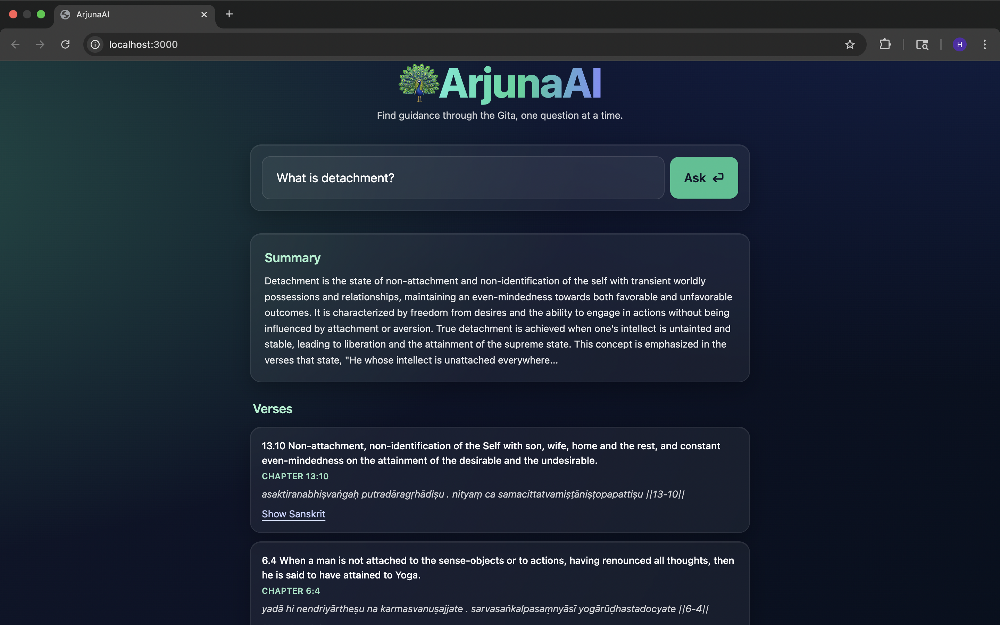

## ArjunaAI 🦚

An AI-powered Bhagavad Gita assistant built with FastAPI, Next.js, Pinecone, and OpenAI. ArjunaAI allows users to ask questions in natural language and receive concise, evidence-based answers grounded in verses from the Bhagavad Gita.

## Features

- Verse-Aware Retrieval (RAG style):

-  Stores all 700+ verses of the Gita in a Pinecone vector database

- Retrieves the most relevant verses for a query using OpenAI embeddings

- Supports exact verse lookup (e.g., typing 2:47)

## Concise Answer Generation:

- Generates a four-sentence summary of the answer using GPT-4o or o4-mini

- Displays both the interpretation and the source verses side by side

- Interactive UI (Next.js + Tailwind):

- Centered “ArjunaAI” hero with peacock-inspired design

- Large search bar with ⏎ (Enter) button for quick queries

- Verse cards with English translation, chapter/verse reference, and toggle for Sanskrit text

## Dockerized Architecture:

- Backend: FastAPI + Pinecone client + OpenAI API

- Frontend: Next.js with Tailwind CSS

- Easy orchestration with Docker Compose

## How to Get Started
1. Clone the Repository
git clone https://github.com/HarshitaThota/ArjunaAI.git
cd ArjunaAI

2. Install Dependencies

- Backend (FastAPI):

    cd backend
    pip install -r requirements.txt

- Frontend (Next.js):

    cd frontend/arjuna-ai
    npm install

3. Set Environment Variables

Copy .env.example to .env and fill in your keys:

- OPENAI_API_KEY=your-openai-key 
- PINECONE_API_KEY=your-pinecone-key 
- PINECONE_INDEX=gita-rag 
- NEXT_PUBLIC_BACKEND_URL=http://localhost:8000/ask

4. Index the Dataset (one-time)

    Ensure your Bhagwad_Gita.csv is in backend/app/data/, then run:

    docker compose run --rm backend python app/indexer.py

5. Run the Application

- Option A – Docker (prod build):

    docker compose up --build
    # Frontend: http://localhost:3000
    # Backend:  http://localhost:8000/health

- Option B – Dev (hot reload):

    Frontend (Node ≥ 18.18, ideally 20):

    cd frontend/arjuna-ai
    npm run dev

Backend (with reload):

    cd backend
    uvicorn app.main:app --reload --host 0.0.0.0 --port 8000

    Usage Process

    Open the frontend at http://localhost:3000

    Enter a question in the search bar, e.g.:

    “What does the Gita say about detachment?”

    “2:47” (exact verse lookup)

    Hit Ask ⏎

    View results:

    Answer summary (4 sentences)

    Supporting verses (with Sanskrit toggle, translation, and reference)

## Built With (what each piece does)

OpenAI (GPT-4o / o4-mini) — Generates the two-sentence answer from retrieved verses.

OpenAI Embeddings (text-embedding-3-large) — Converts verses and queries into vectors for semantic search.

Pinecone — Vector database to store verse embeddings and perform fast similarity search.

FastAPI — Backend service exposing /ask and running the retrieval + generation pipeline.

Next.js + Tailwind CSS — Interactive frontend with a clean, peacock-themed UI.

Docker — Containers for backend and frontend so you can run everything without local installs.

## Credits

Dataset: Bhagavad Gita (Kaggle, a2m2a2n2) 
[Link](https://www.kaggle.com/datasets/a2m2a2n2/bhagwad-gita-dataset)